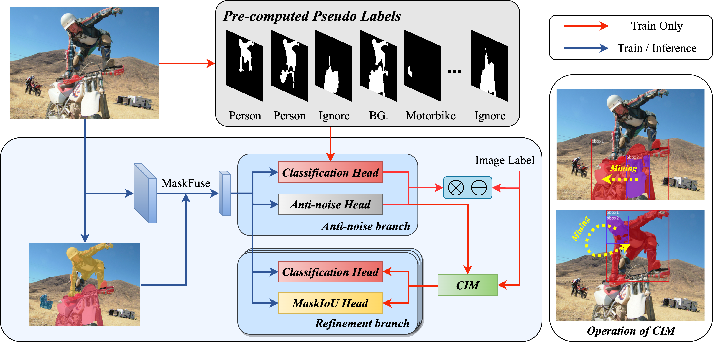

# Complete Instances Mining for Weakly Supervised Instance Segmentation

This project hosts the code for implementing the CIM algorithm for weakly supervised instance segmentation.
 

## Installation
### Setup with Conda
We suggest to create a new conda environment. 

```bash
# create environment
conda create --name CIM python=3.6
conda activate CIM
```

Then, install the following packages:

- torchvision: `pip install torch==1.10.0+cu111 torchvision==0.11.0+cu111 torchaudio==0.10.0 -f https://download.pytorch.org/whl/torch_stable.html`
- mmcv: `pip install mmcv-full -f https://download.openmmlab.com/mmcv/dist/cu111/torch1.10.0/index.html`

Finally, install other relevant dependencies.
```bash
pip install -r requirements.txt
```

## Preparation
### Datasets
We use the following datasets in our experiments:
- [**VOC2012**](http://host.robots.ox.ac.uk/pascal/VOC/voc2012/)
- [**COCO2017**](https://cocodataset.org/#home)

### Dataset structure
For simplicity, our datasets are structured in the following way:
```
/CIM/data/
├── VOC2012/
│   ├── annotations/
│   ├── JPEGImages/
│   ├── COB_SBD_trainaug/
│   └── COB_SBD_val/
│
├── coco2017/
│   ├── annotations/
│   ├── train2017/
│   ├── val2017/
│   ├── test2017/
│   └── COB-COCO/
│
├── model_weight/
│   ├── prm_voc.pth
│   ├── prm_coco.pth
│   ├── vgg16_caffe.pth
│   └── hrnetv2_w48_imagenet_pretrained.pth
│ 
├── label_assign/
│   ├── voc_2012_label_assign.pkl
│   └── coco_2017_label_assign.pkl
│
├── cob/
│   ├── voc_2012_trainaug.pkl
│   ├── voc_2012_val.pkl
│   ├── coco_2017_train.pkl
│   ├── coco_2017_val.pkl
│   └── coco_2017_test.pkl
│
├── cob_asy_iou/
│   ├── VOC2012/
│   └── coco2017/
│
└── cob_iou/
    ├── VOC2012/
    └── coco2017/

```

#### Note: 
- **`VOC2012/annotations/`** is a folder containing label files in json format.
- **`VOC2012/COB_SBD_trainaug/`**, **`VOC2012/COB_SBD_val/`** and **`coco2017/COB-COCO/`** are folders containing COB files. You can download **`VOC2012/COB_SBD_trainaug/`**, **`VOC2012/COB_SBD_val/`** from [here](https://drive.google.com/drive/folders/16Nvm3AMq3JFpOSIznUpZhVI0QrJazEmw?usp=sharing).
- **`model_weight/`**  is a folder containing weight of models. Weights can be downloaded from [here](https://drive.google.com/drive/folders/1kzFsaPlbYK0OY31a7vqsRLDaJQ2BbAs0?usp=sharing). hrnetv2_w48_imagenet_pretrained.pth can be downloaded from [here](https://github.com/HRNet/HRNet-Image-Classification).
- **`label_assign/`** contains pre-computed pseudo labels for VOC2012 and COCO2017 datasets, link is [here](https://drive.google.com/drive/folders/1j44PAimT7v4RkkOlKbbqcCLAiNf9sXjN?usp=sharing). It also can be created by running **`python tools/pre/AGPL_label_assign.py`**.
- **`cob/`** is a folder containing two dataset proposals. The pkl files contain proposals that are scaled to a size of 7*7. These files will be used in RoiAlign operation. They can be downloaded from [here](https://drive.google.com/drive/folders/144_iTb57xnvBL8R7eDm2U_WF1UBQCtYz?usp=sharing). They also can be created by running **`python tools/pre/generate_7_7_voc.py`** and **`python tools/pre/generate_7_7_coco.py`**. 
- **`cob_iou/`** can be downloaded from [here](https://drive.google.com/drive/folders/1BwS_FaM9OOWzpjAR5Tul2gLgFbv0iN9X?usp=sharing). It also can be created by running **`python tools/pre/create_cob_iou.py`**.
- **`cob_asy_iou/`** can be downloaded from [here](https://drive.google.com/drive/folders/1PZfP9Wz0uL33wMcY6wX--C6Wb_cH1ZHT?usp=sharing). It also can be created by running **`python tools/pre/create_cob_asy_iou.py`**.

## Experiments
### Training
We use `bash ./scripts/train_CIM.sh` to train CIM model.

### Evaluation
We use `bash ./scripts/eval_CIM.sh` to evaluate CIM model.

### Mask R-CNN Refinement
We use `bash ./scripts/generate_msrcnn_label.sh` to generate pseudo labels from CIM for training Mask R-CNN. We use Mask R-CNN implemented by mmdetection for Mask R-CNN Refinement.

### Visualization
We use `bash ./scripts/visual_result_mmcv.sh` to visualize our result.

## Results
Results of instance segmentation on the VOC2012 and COCO datasets can be downloaded [here](https://1drv.ms/f/s!Ah9g93YHHTrAaje14InpZd_XDEw?e=xhEhxT).

## Contact
If you have any questions, please feel free to contact Zecheng Li (lizecheng19@gmail.com). Thank you.

## Acknowledgement
Our implementation is based on these repositories:
- (PRM) https://github.com/ZhouYanzhao/PRM
- (PCL) https://github.com/ppengtang/pcl.pytorch
- (mmdetection) https://github.com/open-mmlab/mmdetection
